# DESPLIEGUE — Evidencias y respuestas

Este documento recopila todas las evidencias y respuestas de la practica.

---

## Parte 1 — Evidencias minimas

### Fase 1: Instalacion y configuracion

1) Servicio Nginx activo
- Que demuestra: que el contenedor nginx está alzado y que los puertos 8090 y 8443 están mapeados a los puertos del contenedor 80 y 443.
- Comando: docker ps
- Evidencia:  

2) Configuracion cargada
- Que demuestra: verifica que el archivo `default.conf` local se ha montado correctamente dentro del contenedor en `/etc/nginx/conf.d/`.
- Comando: `docker compose exec web ls -l /etc/nginx/conf.d/`
- Evidencia:  

3) Resolucion de nombres
- Que demuestra: Muestra que el navegador es capaz de acceder al servidor web mediante la dirección configurada, `localhost` en este entorno Docker/Windows, y recibir respuesta.
- Evidencia:  

4) Contenido Web
- Que demuestra: Confirma que el servidor está sirviendo los archivos HTML/CSS personalizados y no la página de bienvenida por defecto de Nginx.
- Evidencia:

### Fase 2: Transferencia SFTP (Filezilla)

5) Conexion SFTP exitosa
- Que demuestra: Confirma que el servicio SSH/SFTP está accesible desde el exterior en el puerto no estándar (2223) y que las credenciales configuradas en el `docker-compose.yml` son válidas para establecer la sesión.
- Evidencia:
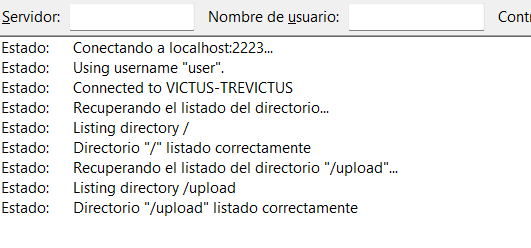

6) Permisos de escritura
- Que demuestra: Verifica que el usuario del contenedor SFTP tiene los permisos correcto para escribir en el volumen compartido. Sino, no podríamos actualizar la web.
- Evidencia:
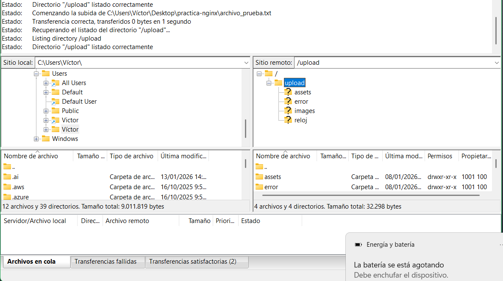

### Fase 3: Infraestructura Docker

7) Contenedores activos
- Que demuestra: Se ven los dos servicios (`web` y `sftp-server`) levantados y los mapeos de puertos críticos: HTTP (8090->80), HTTPS (8443->443) y SFTP (2223->22).
- Comando: docker ps
- Evidencia:

8) Persistencia (Volumen compartido)
- Que demuestra: la conexión entre el sistema de archivos del contenedor SFTP y el contenedor Nginx. Al subir un archivo por SFTP, este aparece en el navegador web sin necesidad de reconstruir los contenedores.
- Evidencia:
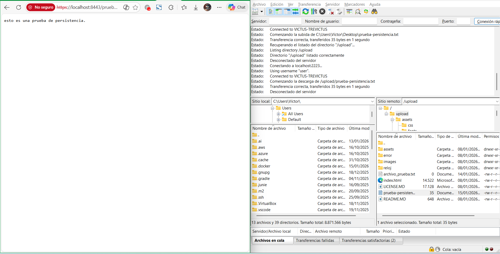

9) Despliegue multi-sitio
- Que demuestra: que Nginx está configurado para servir diferentes aplicaciones basándose en la ruta de la URL la raíz `/` muestra la web principal y `/reloj` la secundaria.
- Evidencia:

### Fase 4: Seguridad HTTPS

10) Cifrado SSL
- Que demuestra: que el servidor está escuchando en el puerto seguro (443 interno, 8443 externo) y es capaz de realizar el "handshake" TLS utilizando los certificados autofirmados generados.
- Evidencia:

11) Redireccion forzada
- Que demuestra: el puerto 80 funciona. Cualquier petición insegura es respondida con un código `301 Moved Permanently` hacia la versión HTTPS, forzando la seguridad.
- Evidencia:
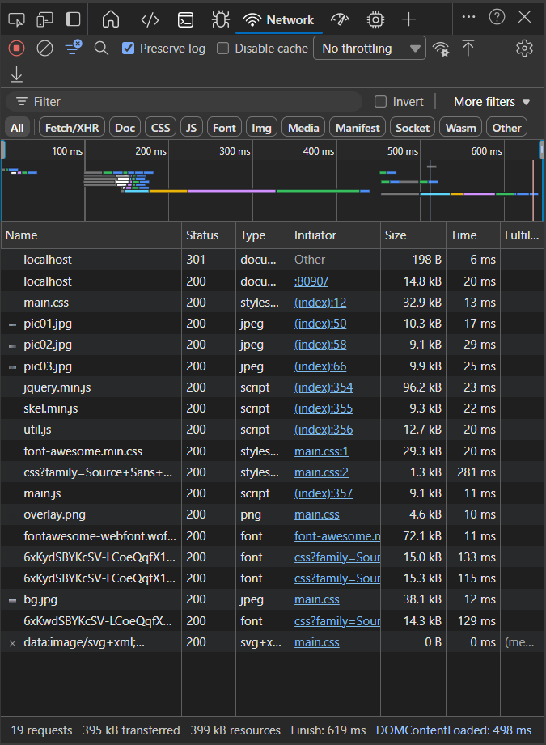

---

## Parte 2 — Evaluacion RA2 (a–j)

### a) Parametros de administracion
- Respuesta:
**worker_processes:** Define los procesos de trabajo. Configuración incorrecta: Poner `1` en servidores multicore desaprovecha CPU.
**worker_connections:** Conexiones por proceso. Configuración incorrecta: Valor muy bajo (ej. 10) causa denegación de servicio con pocos usuarios.
**access_log / error_log:** Rutas de registro. Configuración incorrecta: Rutas sin permisos impiden el arranque.
**keepalive_timeout:** Tiempo de espera de conexión. Configuración incorrecta: Valor muy alto consume RAM en exceso.
**include:** Carga configuraciones extra. Error típico: No incluir `conf.d/*.conf` rompe los sitios virtuales.
**gzip:** Compresión. Error: Tenerlo en `off` aumenta el consumo de ancho de banda.  
- Evidencias:
  - evidencias/a-01-grep-nginxconf.png
  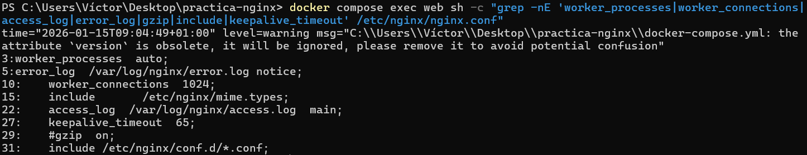
  - evidencias/a-02-nginx-t.png
  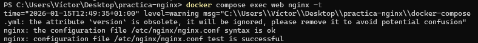
  - evidencias/a-03-reload.png
  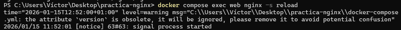

### b) Ampliacion de funcionalidad + modulo investigado
- Opcion elegida B2:
- Respuesta:
Se han añadido las siguientes cabeceras de seguridad en `default.conf` para proteger a los clientes:
`X-Frame-Options: DENY`: Previene ataques de Clickjacking impidiendo que la web se incruste en iframes.
`X-Content-Type-Options: nosniff`: Evita que el navegador ejecute archivos como tipos MIME diferentes a los declarados.
`Content-Security-Policy`: Define orígenes confiables para evitar ataques XSS.
- Evidencias B2: 
  - evidencias/b2-01-defaultconf-headers.png
  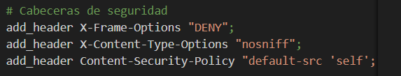
  - evidencias/b2-02-nginx-t.png
  
  - evidencias/b2-03-curl-https-headers.png
  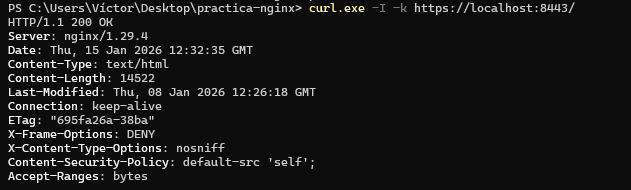

#### Modulo investigado: ModSecurity (WAF)
- Para que sirve: Es un cortafuegos de aplicaciones web WAF. Analiza el tráfico HTTP entrante en tiempo real y bloquea ataques comunes como inyecciones SQL, XSS o intentos de explotación de vulnerabilidades conocidas.
- Como se instala/carga: Tradicionalmente se requería compilar el servidor desde el código fuente añadiendo el módulo. En versiones modernas, se puede cargar como módulo dinámico `load_module modules/ngx_http_modsecurity_module.so;` instalando el paquete `libnginx-mod-security` y configurando el conector.
- Fuente(s):

### c) Sitios virtuales / multi-sitio
- Respuesta:
**Diferencia:** El multi-sitio por *path* usa el mismo dominio y puerto, diferenciando servicios por la carpeta (ej. `/` vs `/reloj`). El multi-sitio por *nombre* usa la directiva `server_name` para servir diferentes webs según el dominio (ej. `a.com` vs `b.com`) en la misma IP.
**Tipos adicionales:** Por puerto escuchar en 8080 y 8090 y por IP.
- Evidencias:
  - evidencias/c-01-root.png
  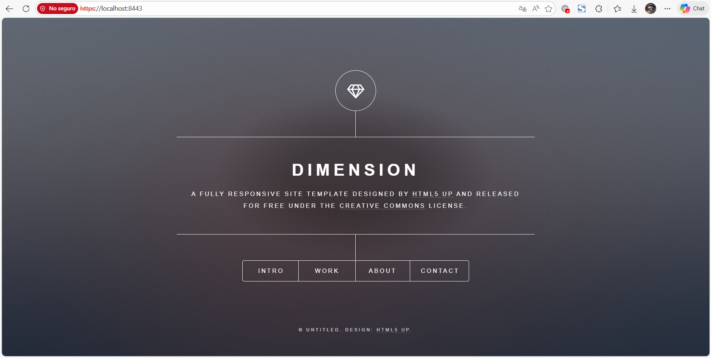
  - evidencias/c-02-reloj.png
  
  - evidencias/c-03-defaultconf-inside.png
  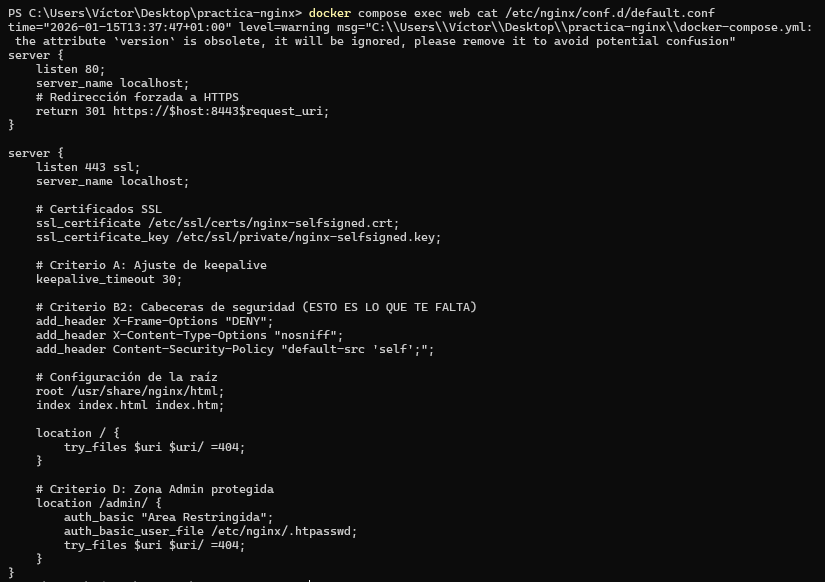

### d) Autenticacion y control de acceso
- Respuesta:
- Evidencias:
  - evidencias/d-01-admin-html.png
  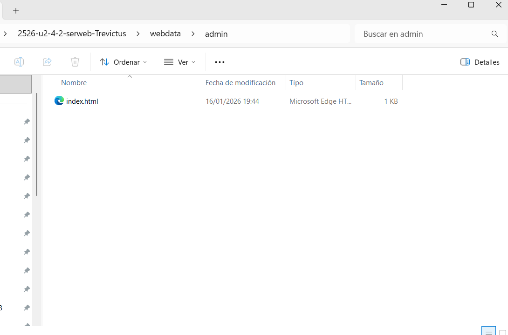
  - evidencias/d-02-defaultconf-auth.png
  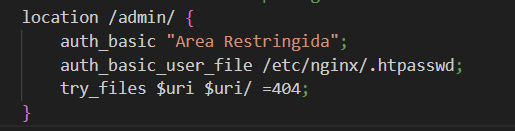
  - evidencias/d-03-curl-401.png
  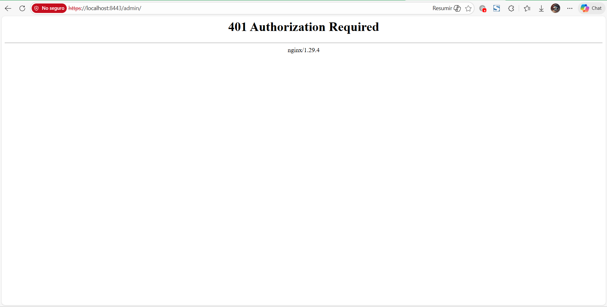
  - evidencias/d-04-curl-200.png
  

### e) Certificados digitales
- Respuesta: se ha protegido el directorio `/admin/` utilizando el módulo `auth_basic`.
Se ha generado un archivo `.htpasswd` con credenciales encriptadas y se ha montado en el contenedor.
Al acceder sin credenciales, el servidor responde `401 Unauthorized`.
Al proveer usuario y contraseña correctos, permite el acceso (`200 OK`).
- Evidencias:
  - evidencias/e-01-ls-certs.png
  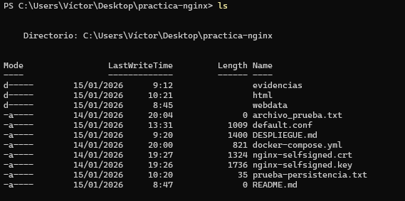
  - evidencias/e-02-compose-certs.png
  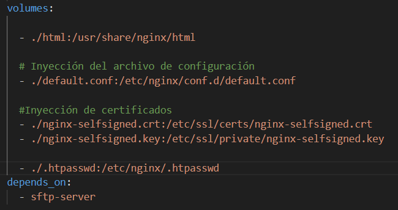
  - evidencias/e-03-defaultconf-ssl.png
  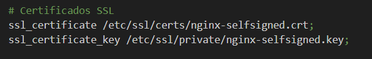

### f) Comunicaciones seguras
- Respuesta: **Bloque Puerto 80:** Su única función es capturar tráfico inseguro y redirigirlo (`return 301`) al puerto HTTPS. No sirve contenido.
**Bloque Puerto 443:** Maneja el cifrado SSL/TLS y sirve el contenido real. Garantiza que ningún usuario navegue por la versión insegura.
- Evidencias:
  - evidencias/f-01-https.png
  
  - evidencias/f-02-301-network.png
  

### g) Documentacion
- Respuesta: contiene toda la documentación de arquitectura, configuración, decisiones de seguridad y evidencias requeridas.
- Evidencias: enlaces a todas las capturas

### h) Ajustes para implantacion de apps
- Respuesta: Al desplegar la app "Reloj" en la subruta `/reloj`, he tenido que considerar las rutas de los recursos. Si el HTML del reloj pidiera una imagen en `/logo.png`, fallaría porque buscaría en la raíz del servidor. Debe usar rutas relativas (`./logo.png` o `logo.png`).
**Permisos SFTP:** Un problema común es que el usuario suba archivos y Nginx no pueda leerlos. La solución en Docker es asegurar que los archivos subidos tengan permisos de lectura para "otros" con `chmod 644` o que el usuario pertenezca al grupo `www-data`.
- Evidencias:
  - evidencias/h-01-root.png
  
  - evidencias/h-02-reloj.png
  

### i) Virtualizacion en despliegue
- Respuesta:  
**Instalación Nativa:** Nginx se instala directamente sobre el SO. Comparte librerías con el sistema. Difícil de mover a otro servidor. Si actualizas el SO, puedes romper Nginx.  
**Contenedor Docker:** Nginx corre en un entorno aislado con sus propias librerías. Es efímero. La configuración es portable mediante `docker-compose.yml`. Garantiza que funciona igual en mi PC y en producción.
- Evidencias:
  - evidencias/i-01-compose-ps.png
  

### j) Logs: monitorizacion y analisis
- Respuesta: monitorización en tiempo real usando `docker compose logs -f`.
Se ha generado accesos correctos y errores 404. Se han extraído métricas usando comandos de análisis de texto (`awk`, `uniq`) sobre el fichero `access.log` interno del contenedor para identificar las URLs más visitadas y el conteo de errores.
- Evidencias:
  - evidencias/j-01-logs-follow.png
  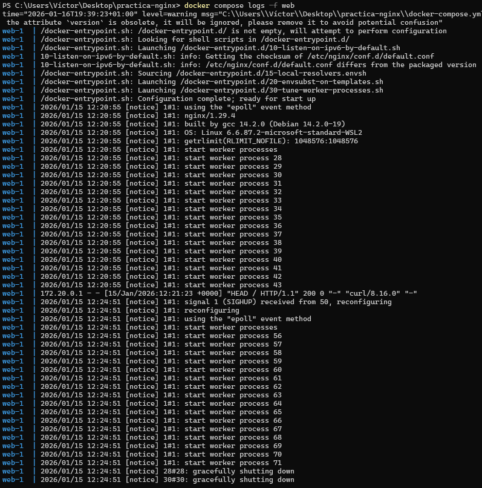
  - evidencias/j-02-metricas.png
  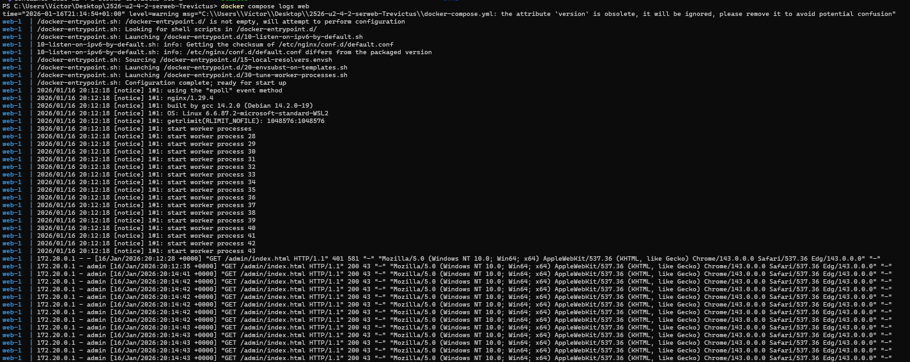

---

## Checklist final

### Parte 1
- [X] 1) Servicio Nginx activo
- [X] 2) Configuracion cargada
- [X] 3) Resolucion de nombres
- [X] 4) Contenido Web (Cloud Academy)
- [X] 5) Conexion SFTP exitosa
- [X] 6) Permisos de escritura
- [X] 7) Contenedores activos
- [X] 8) Persistencia (Volumen compartido)
- [X] 9) Despliegue multi-sitio (/reloj)
- [X] 10) Cifrado SSL
- [X] 11) Redireccion forzada (301)

### Parte 2 (RA2)
- [X] a) Parametros de administracion
- [X] b) Ampliacion de funcionalidad + modulo investigado
- [X] c) Sitios virtuales / multi-sitio
- [X] d) Autenticacion y control de acceso
- [X] e) Certificados digitales
- [X] f) Comunicaciones seguras
- [X] g) Documentacion
- [X] h) Ajustes para implantacion de apps
- [X] i) Virtualizacion en despliegue
- [X] j) Logs: monitorizacion y analisis
