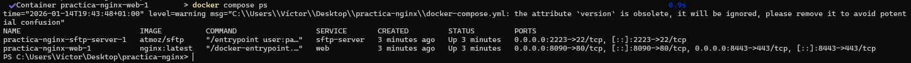
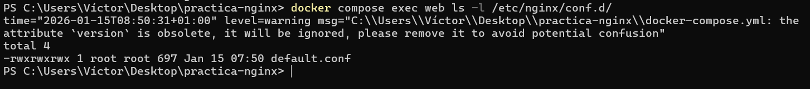
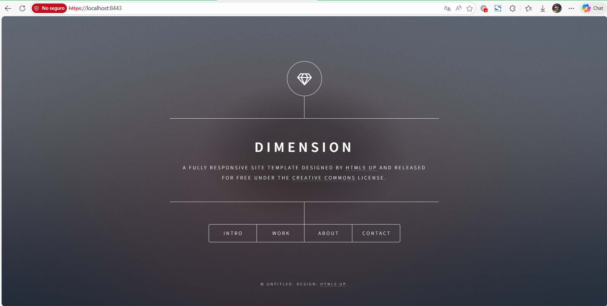
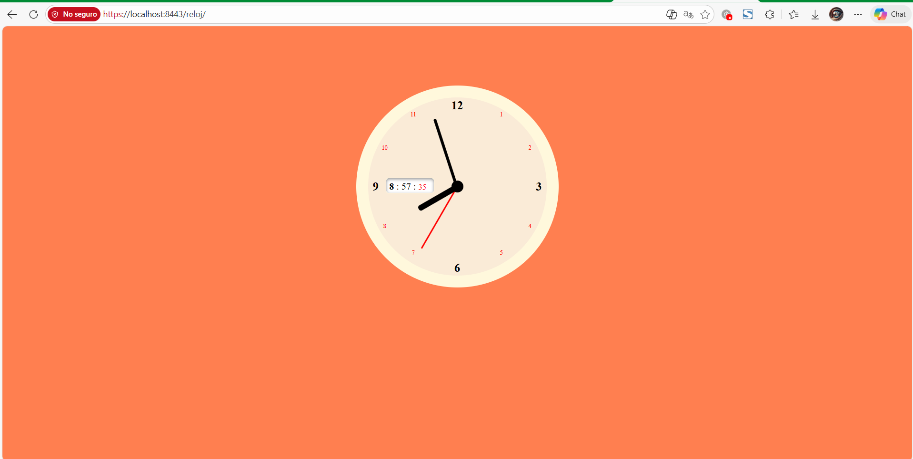

# DESPLIEGUE — Evidencias y respuestas

Este documento recopila todas las evidencias y respuestas de la practica.

---

## Parte 1 — Evidencias minimas

### Fase 1: Instalacion y configuracion

1) Servicio Nginx activo
- Que demuestra: que el contenedor nginx está alzado y que los puertos 8090 y 8443 están mapeados a los puertos del contenedor 80 y 443.
- Comando: docker ps
- Evidencia:  

2) Configuracion cargada
- Que demuestra: verifica que el archivo `default.conf` local se ha montado correctamente dentro del contenedor en `/etc/nginx/conf.d/`.
- Comando: `docker compose exec web ls -l /etc/nginx/conf.d/`
- Evidencia:  

3) Resolucion de nombres
- Que demuestra: Muestra que el navegador es capaz de acceder al servidor web mediante la dirección configurada, `localhost` en este entorno Docker/Windows, y recibir respuesta.
- Evidencia:  

4) Contenido Web
- Que demuestra: Confirma que el servidor está sirviendo los archivos HTML/CSS personalizados y no la página de bienvenida por defecto de Nginx.
- Evidencia:

### Fase 2: Transferencia SFTP (Filezilla)

5) Conexion SFTP exitosa
- Que demuestra: Confirma que el servicio SSH/SFTP está accesible desde el exterior en el puerto no estándar (2223) y que las credenciales configuradas en el `docker-compose.yml` son válidas para establecer la sesión.
- Evidencia:

6) Permisos de escritura
- Que demuestra:
- Evidencia:

### Fase 3: Infraestructura Docker

7) Contenedores activos
- Que demuestra:
- Comando:
- Evidencia:

8) Persistencia (Volumen compartido)
- Que demuestra:
- Evidencia:

9) Despliegue multi-sitio
- Que demuestra:
- Evidencia:

### Fase 4: Seguridad HTTPS

10) Cifrado SSL
- Que demuestra:
- Evidencia:

11) Redireccion forzada
- Que demuestra:
- Evidencia:

---

## Parte 2 — Evaluacion RA2 (a–j)

### a) Parametros de administracion
- Respuesta:
- Evidencias:
  - evidencias/a-01-grep-nginxconf.png
  - evidencias/a-02-nginx-t.png
  - evidencias/a-03-reload.png

### b) Ampliacion de funcionalidad + modulo investigado
- Opcion elegida (B1 o B2):
- Respuesta:
- Evidencias (B1 o B2):
  - evidencias/b1-01-gzipconf.png
  - evidencias/b1-02-compose-volume-gzip.png
  - evidencias/b1-03-nginx-t.png
  - evidencias/b1-04-curl-gzip.png
  - evidencias/b2-01-defaultconf-headers.png
  - evidencias/b2-02-nginx-t.png
  - evidencias/b2-03-curl-https-headers.png

#### Modulo investigado: <NOMBRE>
- Para que sirve:
- Como se instala/carga:
- Fuente(s):

### c) Sitios virtuales / multi-sitio
- Respuesta:
- Evidencias:
  - evidencias/c-01-root.png
  - evidencias/c-02-reloj.png
  - evidencias/c-03-defaultconf-inside.png

### d) Autenticacion y control de acceso
- Respuesta:
- Evidencias:
  - evidencias/d-01-admin-html.png
  - evidencias/d-02-defaultconf-auth.png
  - evidencias/d-03-curl-401.png
  - evidencias/d-04-curl-200.png

### e) Certificados digitales
- Respuesta:
- Evidencias:
  - evidencias/e-01-ls-certs.png
  - evidencias/e-02-compose-certs.png
  - evidencias/e-03-defaultconf-ssl.png

### f) Comunicaciones seguras
- Respuesta:
- Evidencias:
  - evidencias/f-01-https.png
  - evidencias/f-02-301-network.png

### g) Documentacion
- Respuesta:
- Evidencias: enlaces a todas las capturas

### h) Ajustes para implantacion de apps
- Respuesta:
- Evidencias:
  - evidencias/h-01-root.png
  - evidencias/h-02-reloj.png

### i) Virtualizacion en despliegue
- Respuesta:
- Evidencias:
  - evidencias/i-01-compose-ps.png

### j) Logs: monitorizacion y analisis
- Respuesta:
- Evidencias:
  - evidencias/j-01-logs-follow.png
  - evidencias/j-02-metricas.png

---

## Checklist final

### Parte 1
- [ ] 1) Servicio Nginx activo
- [ ] 2) Configuracion cargada
- [ ] 3) Resolucion de nombres
- [ ] 4) Contenido Web (Cloud Academy)
- [ ] 5) Conexion SFTP exitosa
- [ ] 6) Permisos de escritura
- [ ] 7) Contenedores activos
- [ ] 8) Persistencia (Volumen compartido)
- [ ] 9) Despliegue multi-sitio (/reloj)
- [ ] 10) Cifrado SSL
- [ ] 11) Redireccion forzada (301)

### Parte 2 (RA2)
- [ ] a) Parametros de administracion
- [ ] b) Ampliacion de funcionalidad + modulo investigado
- [ ] c) Sitios virtuales / multi-sitio
- [ ] d) Autenticacion y control de acceso
- [ ] e) Certificados digitales
- [ ] f) Comunicaciones seguras
- [ ] g) Documentacion
- [ ] h) Ajustes para implantacion de apps
- [ ] i) Virtualizacion en despliegue
- [ ] j) Logs: monitorizacion y analisis
